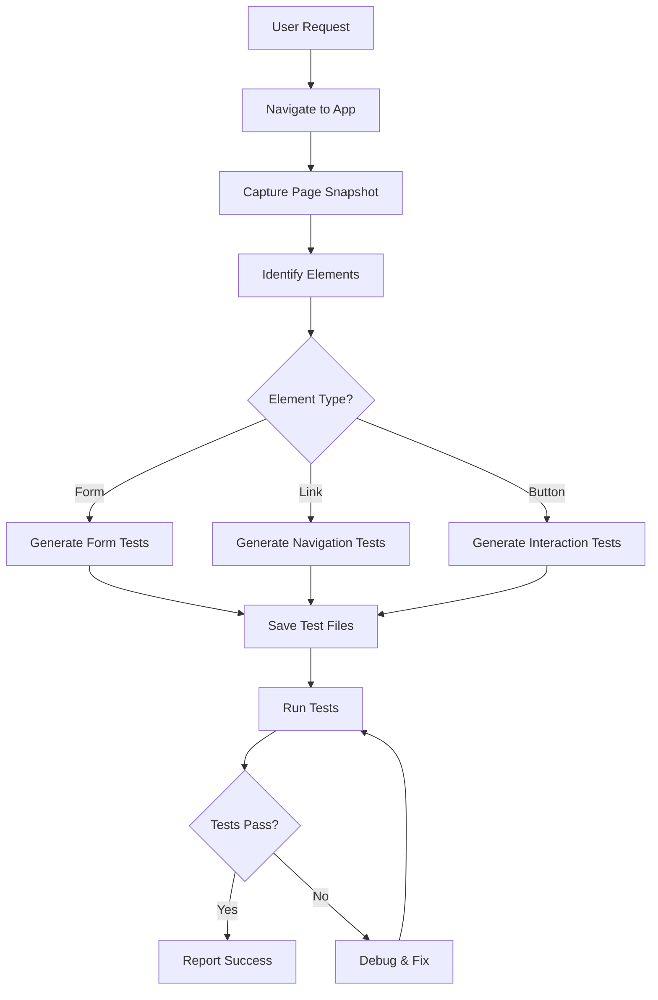

# @arog Playwright Test Generator Agent

## Agent Configuration

This is the configuration for @arog's autonomous E2E test generation capability.

### Agent: `playwright-test-generator`

**Purpose**: Automatically generate E2E tests by exploring web applications

**Capabilities**:
- Navigate to web applications
- Capture page structure and UI elements
- Identify interactive components (forms, buttons, links)
- Generate Playwright test code automatically
- Take screenshots for documentation
- Run tests to verify they work

**MCP Server Used**: Playwright MCP Server

**Available Tools**:
1. `mcp_playwright_browser_navigate` - Navigate to URLs
2. `mcp_playwright_browser_snapshot` - Get page accessibility tree
3. `mcp_playwright_browser_click` - Click elements
4. `mcp_playwright_browser_type` - Fill forms
5. `mcp_playwright_browser_select_option` - Select dropdowns
6. `mcp_playwright_browser_hover` - Hover over elements
7. `mcp_playwright_browser_take_screenshot` - Capture screenshots
8. `mcp_playwright_browser_evaluate` - Execute JavaScript
9. `mcp_playwright_browser_wait_for` - Wait for conditions
10. `mcp_playwright_browser_close` - Close browser

### Usage

**Via Copilot Chat**:
```
@arog generate E2E tests for http://localhost:3000
```

**Via CLI**:
```bash
cd .arog
node scripts/auto-generate-e2e-tests.js
```

### How @arog Generates Tests

1. **Navigate**: Uses `mcp_playwright_browser_navigate` to go to the application
2. **Explore**: Uses `mcp_playwright_browser_snapshot` to capture page structure
3. **Identify**: Analyzes the accessibility tree to find:
   - Forms (login, signup, contact)
   - Buttons and links
   - Input fields
   - Navigation menus
   - Interactive widgets
4. **Interact**: Uses `mcp_playwright_browser_click` and `mcp_playwright_browser_type` to test functionality
5. **Verify**: Captures screenshots and validates behavior
6. **Generate**: Creates test code with proper:
   - Selectors (getByRole, getByLabel, etc.)
   - Assertions (expect)
   - Test structure (describe, test)
   - Documentation

### Example Output

When you say:
```
@arog explore my app and generate tests
```

@arog will create files like:
```javascript
// tests/e2e/login.spec.js
test.describe('Login', () => {
  test('should login with valid credentials', async ({ page }) => {
    await page.goto('/login');
    await page.getByLabel('Email').fill('user@example.com');
    await page.getByLabel('Password').fill('password123');
    await page.getByRole('button', { name: 'Sign in' }).click();
    await expect(page).toHaveURL('/dashboard');
  });
});
```

### Configuration Options

Stored in `.arog/e2e-config.json`:

```json
{
  "url": "http://localhost:3000",
  "command": "npm start",
  "isRunning": false,
  "headedMode": true
}
```

### Advanced Features

**Multi-Page Exploration**:
```
@arog explore all pages starting from /
Generate tests for the complete user journey
```

**Form Testing**:
```
@arog find all forms and generate validation tests
```

**Navigation Testing**:
```
@arog test all navigation links and verify destinations
```

**Visual Testing**:
```
@arog take screenshots of all pages for visual regression
```

### Agent Workflow



### Integration with @arog Orchestrator

The `playwright-test-generator` agent is automatically invoked when:
- User mentions "E2E tests", "Playwright", "test UI"
- User provides a URL with request to generate tests
- User asks to explore an application
- User mentions "browser" or "headed mode"

### Proof of Capability

See `tests/e2e/LIVE-DEMO-auto-generated.spec.js` for a real example where @arog:
1. Navigated to https://example.com
2. Captured page structure
3. Clicked "Learn more" link
4. Verified navigation
5. Took screenshot
6. Generated working test code

All done automatically using Playwright MCP tools! ✅

### Future Enhancements

- [ ] Auto-detect application framework (React, Vue, Angular)
- [ ] Generate component-specific tests
- [ ] Smart retry logic for flaky tests
- [ ] Visual regression testing
- [ ] Performance test generation
- [ ] Accessibility audit automation
- [ ] Mobile device testing
- [ ] Cross-browser test generation

---

**Agent Status**: ✅ ACTIVE & OPERATIONAL

**Last Updated**: January 16, 2026

**MCP Server**: Playwright MCP (connected via VS Code)
